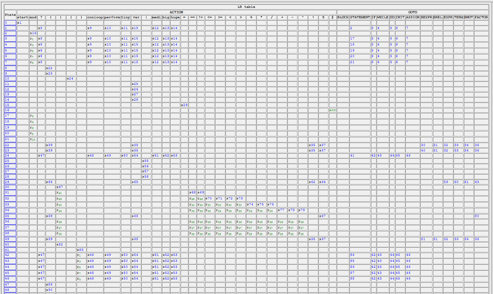
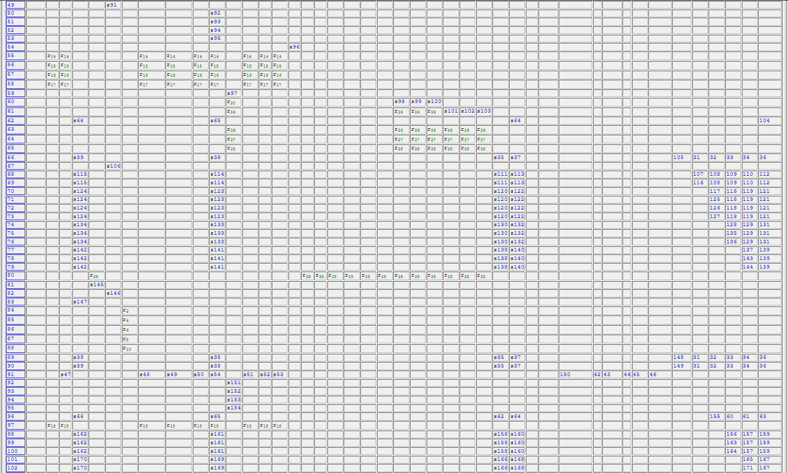
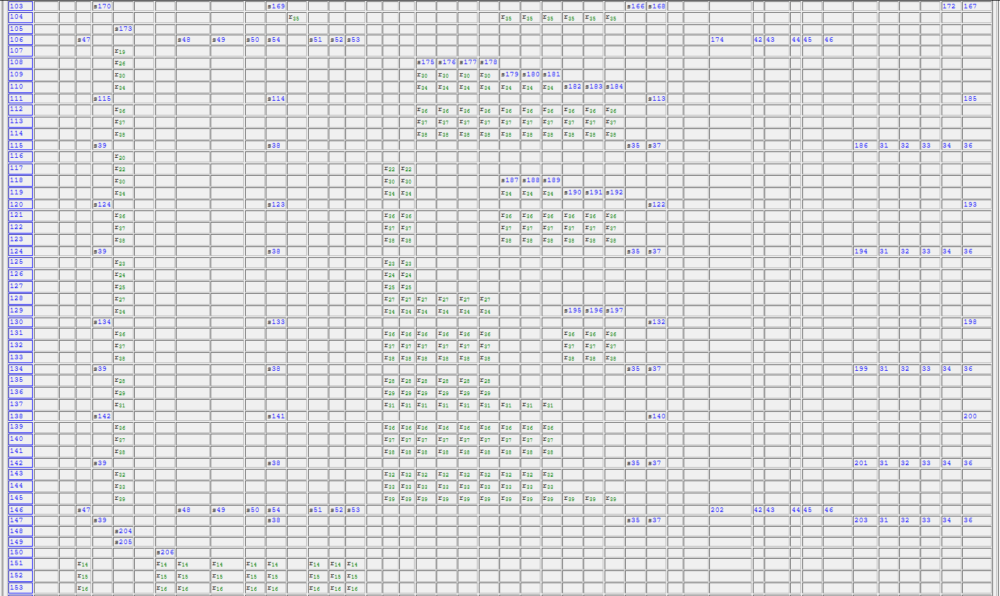
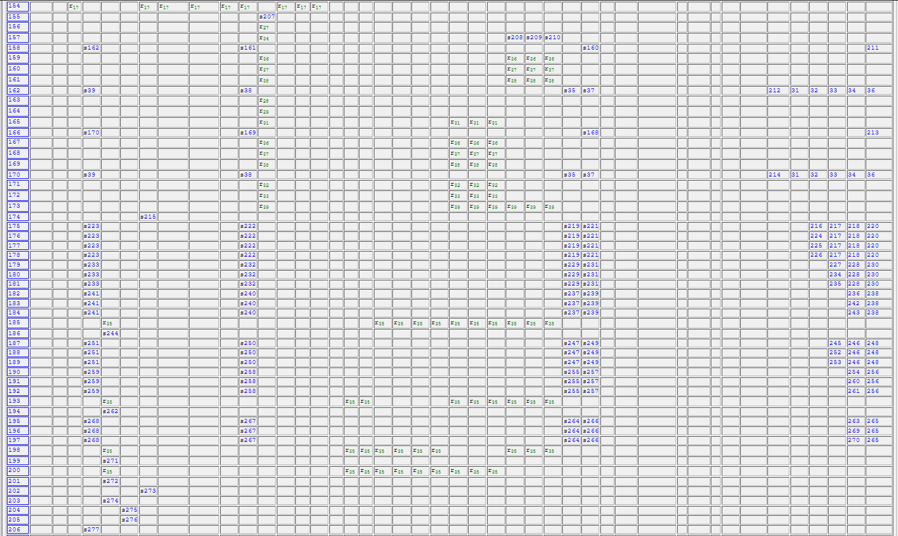
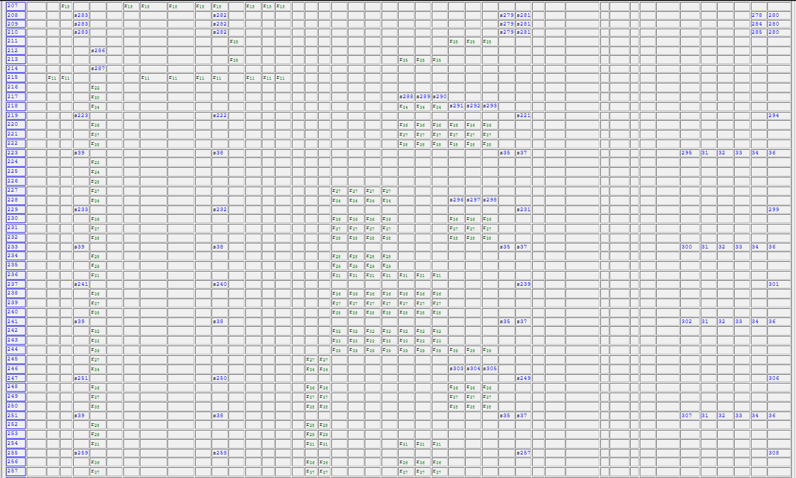

# PLC Test 2
# Regular Expressions
(start)|(end)|(tiny)|(medi)|(big)|(huge)|(conloop)|(forloop)|(perform)|(\?)|(\+)|(-)|(\*)|(\/)|(%)|(<=)|(>=)|(<)|(>)|(==)|(\!=)|(=)|(\()|(\))|(\|)|(\{)|(\})|([0-9]+)|([a-zA-Z_]{6,8})

regular expression matches keywords, symbols, and variable names in separate  
matching groups. tiny is my equivalent of a 1 byte int, medi is a 2  
byte int, big is a 4 byte int, and huge is an 8 byte int. conloop  
replaces while, forloop replaces for, perform replaces do while,  
and ? replaces an if statement. the | character is a statement  
separator.

# integer token codes
0 : "program beginning"  
1 : "program ending"  
2 : "1 byte integer declaration"  
3 : "2 byte integer declaration"  
4 : "4 byte integer declaration"  
5 : "8 byte integer declaration"  
6 : "while loop"  
7 : "for loop"  
8 : "do while loop"  
9 : "if statement"  
10: "add"  
11: "sub"  
12: "multiply"  
13: "divide"  
14: "modulus"  
15: "lessthan or equal"  
16: "greaterthan or equal"  
17: "lessthan"  
18: "greaterthan"  
19: "equal to"  
20: "not equal to"  
21: "variable assignment"  
22: "left paren"  
23: "right paren"  
24: "separator"  
25: "left bracket"  
26: "right bracket"  
27: "integer"  
28: "variable"  

# production rules

&lt;block&gt; --> 'start' {&lt;statement&gt;} 'end'  
&lt;statement&gt; --> &lt;if&gt; | &lt;while&gt; | &lt;do&gt; |&lt;initialize&gt; | &lt;assignment&gt;  
&lt;if&gt; --> '?' '(' &lt;bool_relation&gt; ')' '{' {&lt;statement&gt;} '}'  
&lt;while&gt; --> 'conloop' '(' &lt;bool_relation&gt; ')' '{' {&lt;statement&gt;} '}'  
&lt;do&gt; --> 'perform' '{' {&lt;statement&gt;} '}' 'conloop' '(' &lt;bool_relation&gt; ')'  
&lt;initialize&gt; --> ('tiny'|'medi'|'big'|'huge') [a-zA-Z_]{6,8} '|'  
&lt;assignment&gt; --> [a-zA-Z_]{6,8} '=' &lt;expr&gt; '|'  
&lt;bool_relation&gt; --> &lt;bexpr&gt; {'!='|'==' &lt;bexpr&gt;}  
&lt;bexpr&gt; --> &lt;expr&gt; {'<='|'>='|'<'|'>' &lt;expr&gt;}  
&lt;expr&gt; --> &lt;term&gt; {'\*'|'/'|'%' &lt;term&gt;}  
&lt;term&gt; --> &lt;bnot&gt; {'+'|'-'|'^' &lt;bnot&gt;}  
&lt;bnot&gt; --> [!] &lt;factor&gt;  
&lt;factor&gt; --> [0-9]+ | [a-zA-Z_]{6,8} | '(' &lt;bexpr&gt; ')'  
  
order of operations is PASEMDO (parentheses, addition, subtraction,  
exponent, multiply, divide, modulus)

# LL grammar

  
in the above image I have created a LL(1) table showing that there are no  
FIRST/FIRST or FIRST/FOLLOW errors. There is at most 1 production in each  
table entry. 

# Ambiguous Grammar?

Since the grammar is an LL(1) grammar, it is unabmiguous by definition.

# LEXEME PROCESSOR

 is a program that processes all lexemes in a  
given file and produces a list of all lexemes in order, along with  
their token codes and definitions. Examples of a valid and a failed  
input are shown below. 

# SYNTAX ANALYZER

 is a program that is  
automatically called when the lexer succedes. It checks if the program  
is valid syntactically, and throws an error when it detects an  
invalid program.

# example valid output of lexical processor
```
Lexeme at index  0 is: start     Token is ( 0) program beginning
Lexeme at index  1 is: huge      Token is ( 5) 8 byte integer declaration
Lexeme at index  2 is: var_aa    Token is (28) variable
Lexeme at index  3 is: |         Token is (24) separator
Lexeme at index  4 is: var_aa    Token is (28) variable
Lexeme at index  5 is: =         Token is (21) variable assignment
Lexeme at index  6 is: 1         Token is (27) integer
Lexeme at index  7 is: +         Token is (10) add
Lexeme at index  8 is: 3         Token is (27) integer
Lexeme at index  9 is: |         Token is (24) separator
Lexeme at index 10 is: ?         Token is ( 9) if statement
Lexeme at index 11 is: (         Token is (22) left paren
Lexeme at index 12 is: var_aa    Token is (28) variable
Lexeme at index 13 is: !=        Token is (20) not equal to
Lexeme at index 14 is: 5         Token is (27) integer
Lexeme at index 15 is: )         Token is (23) right paren
Lexeme at index 16 is: {         Token is (25) left bracket
Lexeme at index 17 is: var_aa    Token is (28) variable
Lexeme at index 18 is: =         Token is (21) variable assignment
Lexeme at index 19 is: 0         Token is (27) integer
Lexeme at index 20 is: |         Token is (24) separator
Lexeme at index 21 is: }         Token is (26) right bracket
Lexeme at index 22 is: end       Token is ( 1) program ending
```

# example failed output of lexical processor
```
Lexeme at index  0 is: start     Token is ( 0) program beginning
Lexeme at index  1 is: huge      Token is ( 5) 8 byte integer declaration
Lexeme at index  2 is: var_aa    Token is (28) variable
Lexeme at index  3 is: |         Token is (24) separator
lexeme at index  4 is invalid
```
Lexer is stopped when an invalid token is encountered

# Test1.txt (5 Lexical Errors)
```
Error 1: on line 3 variable_name is greater than 8 characters.
Error 2: on line 4 var_a is too short of a variable name.
Error 3: on line 6 ; doesnt match any symbols and is not a valid
integer or variable name (should be '|').
Error 4: on line 10 [ is not a valid symbol (should be '(')
Error 5: on line 10 ] is not a valid symbol (should be ')')
```

# Test2.txt (5 Syntax Errors)
```
Error 1: on line 2, assignment is being attempted on the same
line as initialization.
Error 2: on line 3, there is a missing mathematical operator,
an extra space, or an extra 3 at (1 + 2 / 3 3).
Error 3: on line 4, in the conditional an assignment symbol is
used instead of an equality symbol.
Error 4: on line 5, there is no statement terminator
Error 5: on line 6/7 there is a missing 'end' symbol.
```

# Test3.txt and Test4.txt (lexically and syntactically correct)
```
Test3.txt output:
...
Lexeme at index 32 is: (         Token is (22) left paren
Lexeme at index 33 is: var_aa    Token is (28) variable
Lexeme at index 34 is: <         Token is (17) lessthan
Lexeme at index 35 is: 50        Token is (27) integer
Lexeme at index 36 is: )         Token is (23) right paren
Lexeme at index 37 is: end       Token is ( 1) program ending
syntax analysis passed


Test4.txt output:
...
Lexeme at index 27 is: variable  Token is (28) variable
Lexeme at index 28 is: )         Token is (23) right paren
Lexeme at index 29 is: )         Token is (23) right paren
Lexeme at index 30 is: |         Token is (24) separator
Lexeme at index 31 is: }         Token is (26) right bracket
Lexeme at index 32 is: end       Token is ( 1) program ending
syntax analysis passed
```

# LR(1) Parse Table

  
  
  
  
  